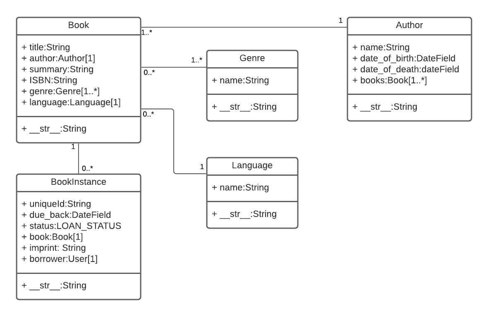

# Django Local Library

Tutorial "Local Library" website written in Django.

For detailed information about this project see the associated <a href="https://developer.mozilla.org/en-US/docs/Learn/Server-side/Django/Tutorial_local_library_website">MDN tutorial home page.</a>

## Overview

This web application creates an online catalog for a small local library, where users can browse available books and manage their accounts.

The main features that have currently been implemented are:
<ul>
  <li>There are models for books, book copies, genre, language and authors.</li>
  <li>Users can view list and detail information for books and authors.</li>
  <li>Admin users can create and manage models. The admin has been optimised (the basic registration is present in admin.py, but commented out).</li>
  <li>Librarians can renew reserved books.</li>
</ul>



## Quick Start

To get this project up and running locally on your computer:
<ol>
    <li>Set up the Python development environment. We recommend using a Python virtual environment.</li>
    <li>Assuming you have Python setup, run the following commands (if you're on Windows you may use ```py``` or ```py -3``` instead of ```python``` to start Python):
```
pip3 install -r requirements.txt
python3 manage.py makemigrations
python3 manage.py migrate
python3 manage.py collectstatic
python3 manage.py test # Run the standard tests. These should all pass.
python3 manage.py createsuperuser # Create a superuser
python3 manage.py runserver
``` </li>
    <li>Open a browser to ```http://127.0.0.1:8000/admin/``` to open the admin site</li>
    <li>Create a few test objects of each type.</li>
    <li>Open tab to ```http://127.0.0.1:8000``` to see the main site, with your new objects.</li>
</ol>
